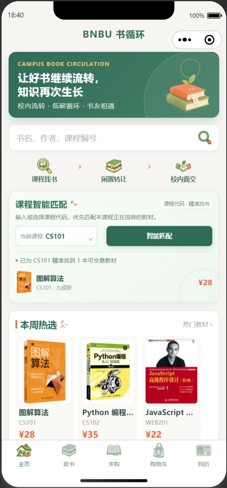
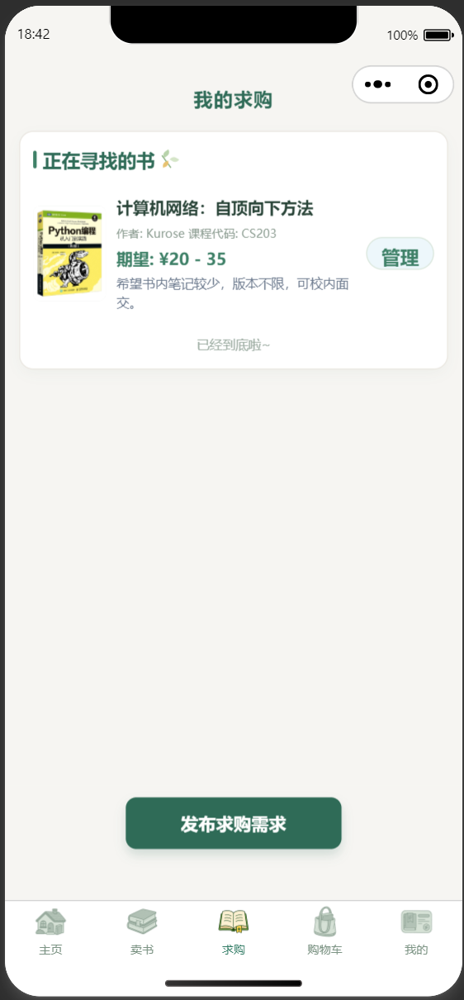
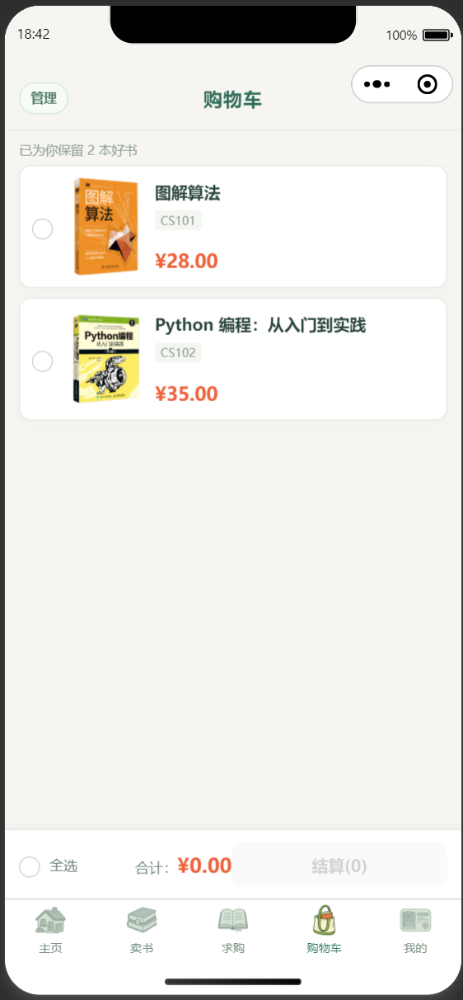
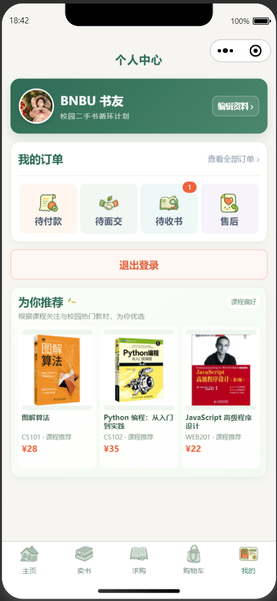
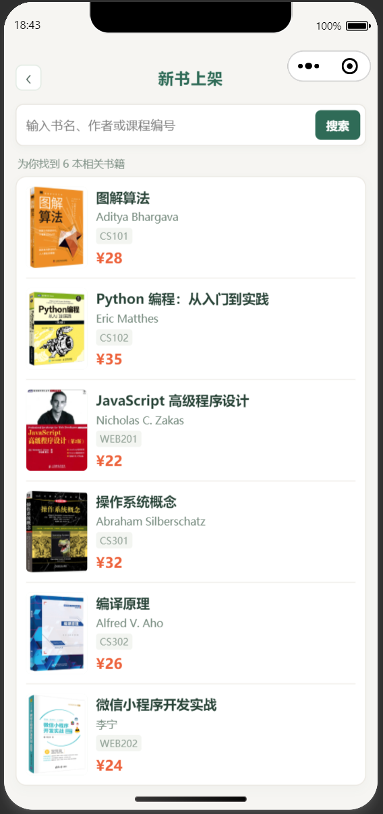

# BNBU BookCycle | BNBU 书循环

> A WeChat Mini Program for course-aware campus textbook exchange — connecting students who need a book with students ready to pass one on.

**BNBU BookCycle** is a product-oriented campus marketplace prototype for second-hand textbooks. It models the complete textbook-circulation journey: finding a book by course, responding to a buy request, listing an unused copy, arranging an on-campus handoff, and confirming receipt.

The user interface and screenshots are intentionally in Chinese because the product is designed for a Chinese-language university context. The repository documentation is in English so that its product and engineering decisions are reviewable by a wider audience.

## Product workflow

```text
Choose a course
  → discover matching textbooks and active buy requests
  → respond with an available copy or create a listing
  → add a book to the cart and place a demo order
  → arrange an on-campus handoff
  → confirm receipt and complete the circulation loop
```

## Key capabilities

- **Course-aware discovery** — textbook listings, course codes, and buy requests are connected rather than presented as an unstructured catalogue.
- **Two-sided matching** — a student can browse, buy, sell, or publish a request; “I have this book” carries the course context into the listing flow.
- **Campus-local transaction model** — the order lifecycle is built around arranging an in-person handoff and confirming receipt, rather than pretending to provide courier logistics.
- **Runnable local demo** — cart, listing, request, order-state, and receipt flows can be demonstrated without purchasing a database or deploying a server.
- **Optional production path** — cloud functions, database migrations, and server-side validation are included as an extension path beyond the local demo.
- **Deliberate visual system** — ink green, warm off-white, and coral accents reinforce a friendly “books in circulation” product identity.

## Interface preview

<p align="center">
  
  
  
</p>

<p align="center">
  
  
  
</p>

## Technical design

| Layer | Design choice |
| --- | --- |
| Client | Native WeChat Mini Program pages, styles, and JavaScript interaction logic |
| Demonstration mode | `utils/demoService.js` maintains mutable in-session data with `DEMO_MODE = true` |
| Production extension | Cloud functions and MySQL migration scripts support a future persistent backend |
| Transaction integrity | In real-backend mode, item status, ownership, and final price are revalidated server-side |
| Local reproducibility | Demo data resets after recompilation, so each presentation starts from a known state |

The checkout experience is a **course-project demonstration only**. It does not invoke real payment or make any charge.

## Run locally

1. Clone the repository and import it into **WeChat DevTools**.
2. Use the AppID in `project.config.json`, or replace it with your own test AppID.
3. Click **Compile**. The default local demo requires no cloud environment or database.

```js
// utils/demoService.js
const DEMO_MODE = true
```

## Optional deployment path

To connect a persistent backend:

1. Deploy the functions in `cloudfunctions/` to a WeChat Cloud Development environment.
2. Configure `DB_HOST`, `DB_USER`, `DB_PASS`, `DB_NAME`, and `DB_PORT` as cloud-function environment variables.
3. Apply the MySQL initialization and incremental scripts in `database-migrations/`.
4. Replace the demo checkout with a real payment workflow only after implementing order creation, callback verification, and idempotency.

## Repository layout

```text
├── pages/                 # Mini Program views, styles, and interactions
├── cloudfunctions/        # Optional server-side functions and validation
├── database-migrations/   # Database initialization and incremental changes
├── utils/demoService.js   # In-session local demonstration service
├── images/                # Product visual assets
└── docs/screenshots/      # README interface previews
```

## Security and scope

- Credentials are not stored in source code; backend values belong in cloud-function environment variables.
- `project.private.config.json` and `.env*` files are excluded from version control.
- The repository contains fictional, local-demo data only.
- This is a portfolio and course-project prototype, not a deployed marketplace or payment service.

## 中文说明

**BNBU 书循环** 是一个面向校园二手教材流转场景设计的微信小程序。项目围绕“课程找书—闲置转让—校内面交—确认收书”构建完整体验：学生可以按课程编号匹配教材，也可以发布求购、响应同学需求、上架闲置书并完成校内面交流程。

项目默认启用本地演示模式，不需要配置数据库或服务器即可在微信开发者工具中体验核心功能；同时保留云函数与数据库迁移方案，作为后续接入真实后端的工程基础。

## Future directions

- Campus identity verification and reputation signals.
- Handoff time and location scheduling with subscription reminders.
- Favourites, reporting, moderation, and textbook-edition matching.
- A carefully designed payment and dispute workflow for a real deployment.
- 
## H5 web version (community contribution)

An independent **H5 + Node** version lives in [`h5-web/`](h5-web/), brought to a different
campus (HZAU / 华中农业大学) and localized there.

What changed relative to this repository:

- **Course-aware discovery → major + grade.** Textbook choice on that campus is driven by the
  study plan and the term, so the home page recommends by `major + grade` and surfaces buy
  requests from the same major (a 53-major × 6-grade catalogue).
- **Demo checkout → lock-then-meet.** "Confirm purchase" locks the book without charging so two
  buyers cannot race; the handoff happens in person on campus. No payment is taken.
- **Contact visibility** becomes a three-level user setting, withheld server-side.
- **Student verification** (enterprise-WeChat screenshot, admin reviewed) gates publishing and
  buying — this already covers the first item under *Future directions* above.
- **Account system** (email + password, email codes, login throttling, account deletion) plus an
  **admin console**, because the H5 build cannot rely on a WeChat identity.

The frontend keeps this repository's `<view>/<text>` markup and `rpx` sizing so pages stay
portable in both directions; the 24 cloud functions map onto 83 REST endpoints in a
self-hosted Node backend. Only the existing `images/` are reused — no binaries are added.

See [`h5-web/README.md`](h5-web/README.md) for the full write-up.
